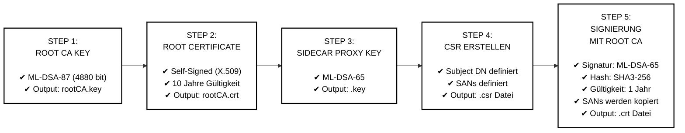

```mermaid
flowchart LR
    Step1["STEP 1:<br/>ROOT CA KEY<br/><br/>✔ ML-DSA-87 (4880 bit)<br/>✔ Output: rootCA.key"]
    
    Step2["STEP 2:<br/>ROOT CERTIFICATE<br/><br/>✔ Self-Signed (X.509)<br/>✔ 10 Jahre Gültigkeit<br/>✔ Output: rootCA.crt"]
    
    Step3["STEP 3:<br/>SIDECAR PROXY KEY<br/><br/>✔ ML-DSA-65<br/>✔ Output: .key"]
    
    Step4["STEP 4:<br/>CSR ERSTELLEN<br/><br/>✔ Subject DN definiert<br/>✔ SANs definiert<br/>✔ Output: .csr Datei"]
    
    Step5["STEP 5:<br/>SIGNIERUNG<br/>MIT ROOT CA<br/><br/>✔ Signatur: ML-DSA-65<br/>✔ Hash: SHA3-256<br/>✔ Gültigkeit: 1 Jahr<br/>✔ SANs werden kopiert<br/>✔ Output: .crt Datei"]
    
    Step1 --> Step2
    Step2 --> Step3
    Step3 --> Step4
    Step4 --> Step5
    
    style Step1 fill:#ffffff,stroke:#000000,stroke-width:2px,color:#000000
    style Step2 fill:#ffffff,stroke:#000000,stroke-width:2px,color:#000000
    style Step3 fill:#ffffff,stroke:#000000,stroke-width:2px,color:#000000
    style Step4 fill:#ffffff,stroke:#000000,stroke-width:2px,color:#000000
    style Step5 fill:#ffffff,stroke:#000000,stroke-width:2px,color:#000000
```